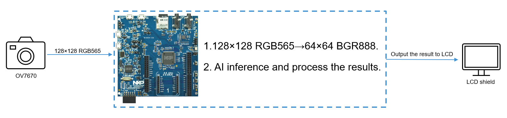
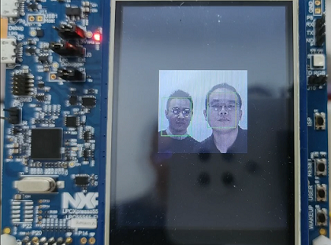

# NXP Application Code Hub

## LPC55S69 Multi Face Detection

This demo demonstrates the AI capabilities of the LPC55S69. It displays the image captured by the camera on the LCD screen and performs face detection.

The resolution of the image captured by the camera is 128×128, the pixel format is RGB565. The original image will be converted to the image resolution and format that the model requires, i.e. the resolution is 64×64 and the pixel format is BGR888.

The processing flow is shown below:

#### Boards: LPCXpresso55S69
#### Categories: AI/ML
#### Peripherals: I2C, SPI, TIMER
#### Toolchains: MDK

## Table of Contents
1. [Software](#step1)
2. [Hardware](#step2)
3. [Setup](#step3)
4. [Results](#step4)
5. [FAQs](#step5) 
6. [Support](#step6)
7. [Release Notes](#step7)

## 1. Software
- MDK Keil 5.38
- SDK 2.10.0

## 2. Hardware
- [LPCXpresso55S69 Development Board](https://www.nxp.com/design/development-boards/lpcxpresso-boards/lpcxpresso55s69-development-board:LPC55S69-EVK)
  - Need rework to connect the OV7670 camera module.
- OV7670 camera module
- Waveshare 2.8inch Touch LCD Shield for Arduino
  - Old version, not Rev2.1, please check [this](https://www.waveshare.com/wiki/2.8inch_TFT_Touch_Shield#accordion2) for details.
  - Need use 0-ohm resistor or solder to short the SB1,SB2,SB3 pads, please check [this](https://www.waveshare.com/wiki/2.8inch_TFT_Touch_Shield#accordion1) for details.

## 3. Setup

### 3.1 Step 1
Rework the LPCXpresso55S69 Development Board:
- LPC55S69 P0_16  -> OV7670 MCLK
- LPC55S69 P0_13 -> OV7670 VSYNC
- LPC55S69 P0_15 -> OV7670 PCLK
- LPC55S69 P0_0 -> OV7670 D0
- LPC55S69 P0_1 -> OV7670 D1
- LPC55S69 P0_2 -> OV7670 D2
- LPC55S69 P0_3 -> OV7670 D3
- LPC55S69 P0_4 -> OV7670 D4
- LPC55S69 P0_5 -> OV7670 D5
- LPC55S69 P0_6 -> OV7670 D6
- LPC55S69 P0_7 -> OV7670 D7
- LPC55S69 P1_20 -> OV7670 SCL
- LPC55S69 P1_21 -> OV7670 SDA

### 3.2 Step 2
Assemble the Waveshare 2.8inch Touch LCD Shield, OV7670 camera module, and LPCXpresso55S69 Development Board.

### 3.2 Step 3
Complie the project and download to the board.

### 3.2 Step 4
Unplug USB cable from the debugger port P6, plug the USB cable into **P5**, and power the board only through **P5**.

## 4. Results
The camera can be moved so that it can capture faces and the LCD screen will display the result of the face detection, the faces will be framed by a green box, as shown below.

## 5. FAQs
No FAQs have been identified for this project.

## 6. Support

#### Project Metadata
<!----- Boards ----->

<!----- Categories ----->

<!----- Peripherals ----->
  

<!----- Toolchains ----->

Questions regarding the content/correctness of this example can be entered as Issues within this GitHub repository.

>**Warning**: For more general technical questions regarding NXP Microcontrollers and the difference in expected funcionality, enter your questions on the [NXP Community Forum](https://community.nxp.com/)

## 7. Release Notes
| Version | Description / Update                           | Date                        |
|:-------:|------------------------------------------------|----------------------------:|
| 1.0     | Initial release on Application Code Hub        | September 8th 2023 |

